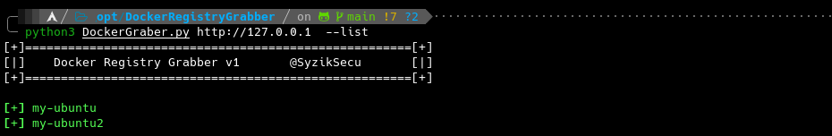
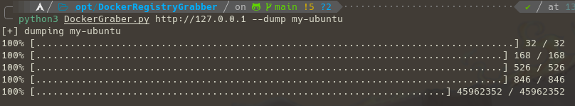
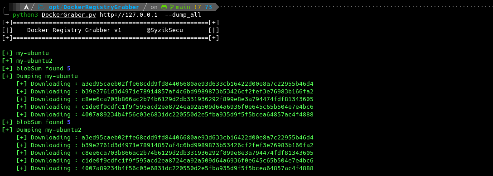
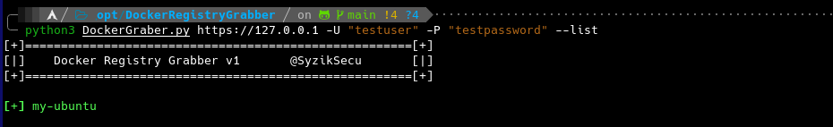
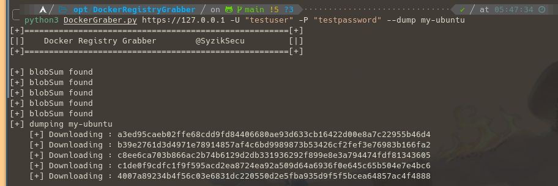
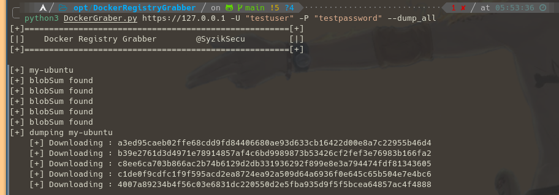
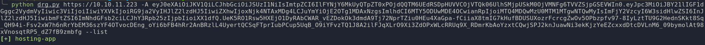
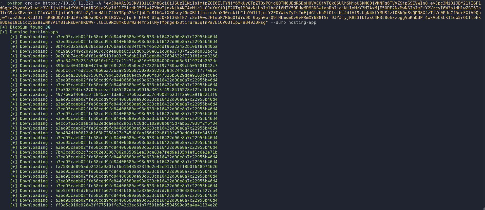

<h1 align="center">DockerRegistryGrabber</h1>
<p align="center">
    A python tool to easly enum and dump images a Docker Registry.
</p>
<p align="center">
<a href="https://twitter.com/intent/follow?screen_name=SyzikSecu"></a>

</p>

---
### Install 
```
git clone git@github.com:Syzik/DockerRegistryGrabber.git
cd DockerRegistryGrabber
python -m pip install -r requirements.txt
```

---
### Usage 
```
usage: drg.py [-h] [-p port] [-U USERNAME] [-P PASSWORD] [-A header] [--list | --dump_all | --dump DOCKERNAME] url

     ____   ____    ____ 
    |  _ \ |  _ \  / ___|
    | | | || |_) || |  _ 
    | |_| ||  _ < | |_| |
    |____/ |_| \_\ \____|
     Docker Registry grabber tool v2 
     by @SyzikSecu

positional arguments:
  url                URL

options:
  -h, --help         show this help message and exit
  -p port            port to use (default : 5000)

Authentication:
  -U USERNAME        Username
  -P PASSWORD        Password
  -A header          Authorization bearer token

Actions:
  --list
  --dump_all
  --dump DOCKERNAME  DockerName

Example commands:
  python drg.py http://127.0.0.1 --list
  python drg.py http://127.0.0.1 --dump my-ubuntu
  python drg.py http://127.0.0.1 --dump_all
  python drg.py https://127.0.0.1 -U 'testuser' -P 'testpassword' --list
  python drg.py https://127.0.0.1 -U 'testuser' -P 'testpassword' --dump my-ubuntu
  python drg.py https://127.0.0.1 -U 'testuser' -P 'testpassword' --dump_all
  python drg.py https://127.0.0.1 -A '<Auth BEARER TOKEN>' --list
  python drg.py https://127.0.0.1 -A '<Auth BEARER TOKEN>' --dump my-ubuntu
  python drg.py https://127.0.0.1 -A '<Auth BEARER TOKEN>' --dump_all
```

### Without authentification 

#### Listing available images  
```
python drg.py http://127.0.0.1 --list
```


#### Dump an image
```
python drg.py http://127.0.0.1 --dump my-ubuntu
``` 


#### Dump images 
```
python drg.py http://127.0.0.1 --dump_all
```


---

### With Basic Authentification

#### Listing available images
```
python drg.py https://127.0.0.1 -U 'testuser' -P 'testpassword' --list
```


#### Dump an image 
```
python drg.py https://127.0.0.1 -U 'testuser' -P 'testpassword' --dump my-ubuntu
```


#### Dump images 
```
python drg.py https://127.0.0.1 -U 'testuser' -P 'testpassword' --dump_all
```


### With Authorization bearer Token

#### Listing available images
```
python drg.py https://127.0.0.1 -A '<Token>' --list
```


#### Dump an image 
```
python drg.py https://127.0.0.1 -A '<Auth Bearer Token>' --dump hosting-app
```


#### Dump an images
```
python drg.py https://127.0.0.1 -A '<Auth Bearer Token>' --dump_all
```
